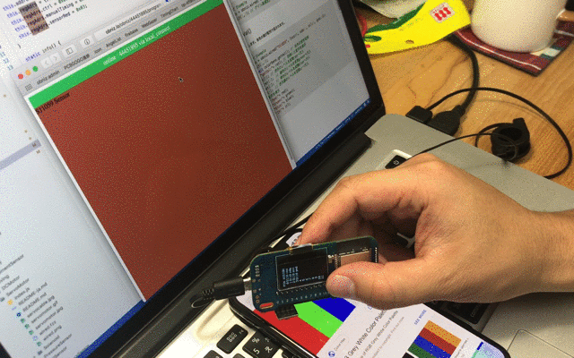

# S11059
Color Sensor S11059-02DT.




## wired(obniz,  { vcc, sda, scl, gnd});

1. vcc: Power supply(3.3v)
2. sda: I2C SDA
3. scl: I2C SCL
4. gnd: Power Supply(0v)

This module's power supply is 3.3v. obniz Board can drive but possibly it is not enough.
So please use 3.3v regulator to generate 3.3v.

This library use obniz Board to supply 3.3v. Some S11059 may throw errors.

```Javascript
// Javascript Example
var colorSens = obniz.wired("S11059", {vcc:0, sda:1, scl:2, gnd:3});
```

## init(Gain, IntergerTime)
Initialize and configure device.

1. Gain : sensor gain. 0: Low, 1: High
2. IntergerTime: Integration time. Loger time becomes more sensitive.

 - 0:87.5uS
 - 1:1.4ms
 - 2:22.4ms
 - 3:179.2ms

```Javascript
// Javascript Example
var colorSens = obniz.wired("S11059", {vcc:0, sda:1, scl:2, gnd:3});
colorSens.init(1,2);
```

## [await] getVal()
measure/get sensor value.
return is an array of mumbers.

[red, green, blue, infrared]

These value indicate strength of color.
value is within 0~0xFFFF


```Javascript
// Javascript Example
var colorSens = obniz.wired("S11059", {vcc:0, sda:1, scl:2, gnd:3});
colorSens.init(1,2);
var ret = await colorSens.getVal(); // get each color
console.log("getVal:"+ ret); // show array
var red = ret[0]; // red level
var green = ret[1];　// green level
var blue = ret[2];　// blue level
var ir = ret[3];　// infrared level
console.log("Red:"+ red);
console.log("Green:"+ green);
console.log("Blue:"+ blue);
console.log("IR:"+ ir);
```
